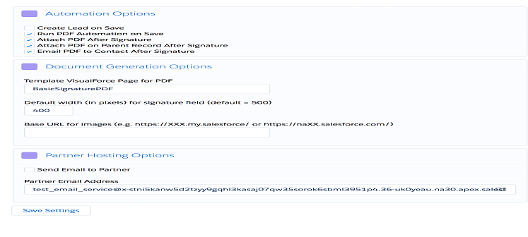

> # Document Generation (VisualForce, s-Docs, or COOLDOX)

### How to set up Simple Signature to work with custom documents, either through a Document Generation app, or via code…
# S
imple Signature is intended to be “simple”, but the one complicated part about it is to create the actual documents where the final signature is supposed to go.  For those geeks who love to code, creating VisualForce pages might be simple, and even fun, but for the majority of people, this might be outside of our toolbox.  For those people, we have three options:

⦁	To A Finish, the creator of Simple Signature, offers a service to  `create VisualForce forms` for your organization.  Depending on how complicated your document is, they might typically cost a few hundred dollars to build.  Contact ⦁	sales@toafinish.com or head on over to the ⦁	www.simplesignatureapp.com website to explore this option in more detail.  The good part of making VisualForce documents is that they can look exactly like you want them, and once they are built, there is no further cost to use them.  But the downside is that if you ever need to change them, you have to go back through the process of hiring somebody again.

Additionally, you also have two Apps that work nicely with Simple Signature and provide document generation.  (Descriptions below from their websites…)

⦁	COOLDOX is a MS-Word Add-in developed to help Salesforce user in creating impressive, rich-text documents like Sales proposals (Quotes), Customer contracts/agreements, and other documents. You can create new templates, import your existing templates from Salesforce, modify them and create rich documents to impress your customers. Documents generated using COOLDOX are immediately available in Salesforce, you can start sharing it with your colleagues or send to customers. 

https://appexchange.salesforce.com/listingDetail?listingId=a0N3A00000ETJDpUAP

⦁	S-Docs is an add-on that generates quotes, contracts, invoices, reports and any other document directly on Salesforce. S-Docs was developed on the force.com platform exclusively for Salesforce with features far superior to the out-of-box capabilities. It's 100% Native - running entirely on the Salesforce Cloud, so it stands alone as the only document generator that does not rely on external servers. Therefore S-Docs is the most secure, fastest, easiest to use and most cost effective solution on the AppExchange.

https://appexchange.salesforce.com/listingDetail?listingId=a0N30000003HeuPEAS

> # App Configuration

If you haven’t already, you need to set two different options in the app configuration…





Go to Setup >Apps->packaging > Installed Packages and click on the "Configure" link next to the Simple Signature app.  If the paid version is enabled, you will see these options:

⦁	Set the two options defined below.  Then click the Save Settings button.

Option |	Description
------ | -------------
Default width (in pixels) for signature field (default = 500)	| This is the width of the signature that will be saved for merging into an s-Docs template.  The smaller the value, the smaller the signature will appear.  If you are OK with the default of 500, then no need to enter anything different here, but it is a good idea to enter a number to avoid confusing in the future.
Base URL for images (e.g. https://XXX.my.salesforce/ or https://naXX.salesforce.com/)	| This value can be gotten by clicking on the Home tab, and then copying the first part of the URL.  This is a critical component, so don't get this wrong or images will be broken.


> # Set Up Signature Fields

Before we can start using Simple Signature with another app, we need to create certain fields that will be used to display the images, and we also might need to do some configuration, and possibly some coding, in order to get everything to work.
⦁	Go to the object you will be using to generate s-Docs/COOLDOX documents from (If it is a standard object, then go to Setup  Customize and click on the object and then go to fields.  If it is a custom object, go to Setup  Create  Objects, and click on the object.)  Now create the following fields:

Field	| API Name | Field Type
------- | -------- | ----------
Signature | Image	SignatureImage__c |	Rich Text Area(32768)
Signed	| Signed__c	| Checkbox

⦁	Go to the Signature object (Setup  > object manager >  Objects > Signature) and create a lookup field to the parent object (the object in step #1.)  You can call it what you want.

If you want to add other fields, editable or read-only, to the Signature page, check chapter 2 for fairly detailed instructons on adding fields.

> # Code To Make it All Work

At this point you have done all you need to do from a configuration perspective, and now you need to just change a few things using code.  If you are not familiar with this type of thing, ask your Salesforce support staff for help.  If nobody in your organization can do it, please contact us and we’ll help as much as we can: support@toafinish.com

> ### Note that this will only work in a sandbox, so if you are in Production, you will need to create this trigger in a sandbox and deploy it here, rather than create it directly here. 

⦁	Still in the Signature object, scroll down to the Triggers section and press the "New" button. Following is code that can be used assuming you followed the above field creation instructions AND assuming the Parent Object you selected in Opportunities.  If not, please update accordingly:


`/*
    COPIES THE SIGNATURE IMAGE FROM THE SIGNATURE OBJECT 
    TO THE PARENT OPPORTUNITY RECORD AND FLAGS IT AS SIGNED
*/`

```javascript
trigger copySig on signature__Signature__c (after insert, after update) {
    Map <Id,signature__Signature__c> sigMap = new Map <Id, signature__Signature__c>();
    Set <Id> newIds = new Set <Id> ();
    
    for ( signature__Signature__c sig:Trigger.new ) {
        if ( sig.signature__Signature__c != null && 
             sig.signature__Signature__c != Trigger.oldMap.get( sig.Id ).signature__Signature__c &&
             sig.Opportunity__c != null ) {
            newIds.add( sig.Opportunity__c );
            sigMap.put( sig.Opportunity__c, sig );
        }
    }
    
    if ( !newIds.isEmpty() ) {
        List < Opportunity > oList = [select Id, SignatureImage__c, Signed__c 
                                         from Opportunity 
                                         where Id in:newIds
                                         limit 1000
                                        ];
        if( !iList.isEmpty() ) {
            for ( Opportunity o:iList ) {
                o.SignatureImage__c = sigMap.get( o.Id ).signature__Signature__c;
                o.Signed__c = TRUE;
            }
            try {
                update oList;
            } catch (exception ex) {}
        }
    }
}

```
