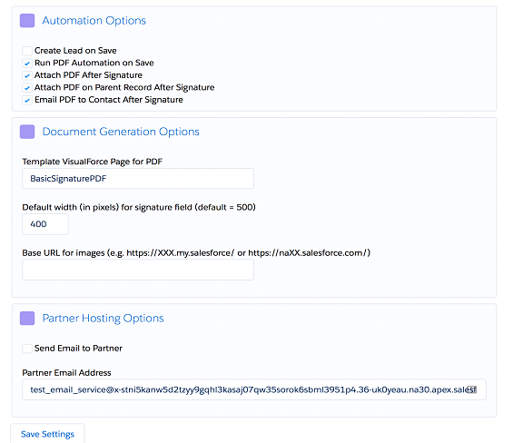

# chapter 4

> # Document Generation (VisualForce, s-Docs, or COOLDOX)

### How to set up Simple Signature to work with custom documents, either through a Document Generation app, or via code…
# S
imple Signature is intended to be “simple”, but the one complicated part about it is to create the actual documents where the final signature is supposed to go.  For those geeks who love to code, creating VisualForce pages might be simple, and even fun, but for the majority of people, this might be outside of our toolbox.  For those people, we have three options:

⦁	To A Finish, the creator of Simple Signature, offers a service to  `create VisualForce forms` for your organization.  Depending on how complicated your document is, they might typically cost a few hundred dollars to build.  Contact ⦁	sales@toafinish.com or head on over to the ⦁	www.simplesignatureapp.com website to explore this option in more detail.  The good part of making VisualForce documents is that they can look exactly like you want them, and once they are built, there is no further cost to use them.  But the downside is that if you ever need to change them, you have to go back through the process of hiring somebody again.

Additionally, you also have two Apps that work nicely with Simple Signature and provide document generation.  (Descriptions below from their websites…)

⦁	COOLDOX is a MS-Word Add-in developed to help Salesforce user in creating impressive, rich-text documents like Sales proposals (Quotes), Customer contracts/agreements, and other documents. You can create new templates, import your existing templates from Salesforce, modify them and create rich documents to impress your customers. Documents generated using COOLDOX are immediately available in Salesforce, you can start sharing it with your colleagues or send to customers. 

https://appexchange.salesforce.com/listingDetail?listingId=a0N3A00000ETJDpUAP

⦁	S-Docs is an add-on that generates quotes, contracts, invoices, reports and any other document directly on Salesforce. S-Docs was developed on the force.com platform exclusively for Salesforce with features far superior to the out-of-box capabilities. It's 100% Native - running entirely on the Salesforce Cloud, so it stands alone as the only document generator that does not rely on external servers. Therefore S-Docs is the most secure, fastest, easiest to use and most cost effective solution on the AppExchange.

https://appexchange.salesforce.com/listingDetail?listingId=a0N30000003HeuPEAS

> # App Configuration

If you haven’t already, you need to set two different options in the app configuration…


Go to Setup >Apps->packaging > Installed Packages and click on the "Configure" link next to the Simple Signature app.  If the paid version is enabled, you will see these options:

⦁	Set the two options defined below.  Then click the Save Settings button.

Option |	Description
------ | -------------
Default width (in pixels) for signature field (default = 500)	| This is the width of the signature that will be saved for merging into an s-Docs template.  The smaller the value, the smaller the signature will appear.  If you are OK with the default of 500, then no need to enter anything different here, but it is a good idea to enter a number to avoid confusing in the future.
Base URL for images (e.g. https://XXX.my.salesforce/ or https://naXX.salesforce.com/)	| This value can be gotten by clicking on the Home tab, and then copying the first part of the URL.  This is a critical component, so don't get this wrong or images will be broken.


> # Set Up Signature Fields

Before we can start using Simple Signature with another app, we need to create certain fields that will be used to display the images, and we also might need to do some configuration, and possibly some coding, in order to get everything to work.
⦁	Go to the object you will be using to generate s-Docs/COOLDOX documents from (If it is a standard object, then go to Setup  Customize and click on the object and then go to fields.  If it is a custom object, go to Setup  Create  Objects, and click on the object.)  Now create the following fields:

Field	| API Name | Field Type
------- | -------- | ----------
Signature | Image	SignatureImage__c |	Rich Text Area(32768)
Signed	| Signed__c	| Checkbox

⦁	Go to the Signature object (Setup  > object manager >  Objects > Signature) and create a lookup field to the parent object (the object in step #1.)  You can call it what you want.

If you want to add other fields, editable or read-only, to the Signature page, check chapter 2 for fairly detailed instructons on adding fields.

> # Code To Make it All Work

At this point you have done all you need to do from a configuration perspective, and now you need to just change a few things using code.  If you are not familiar with this type of thing, ask your Salesforce support staff for help.  If nobody in your organization can do it, please contact us and we’ll help as much as we can: support@toafinish.com

> ### Note that this will only work in a sandbox, so if you are in Production, you will need to create this trigger in a sandbox and deploy it here, rather than create it directly here. 

⦁	Still in the Signature object, scroll down to the Triggers section and press the "New" button. Following is code that can be used assuming you followed the above field creation instructions AND assuming the Parent Object you selected in Opportunities.  If not, please update accordingly:


`/*
    COPIES THE SIGNATURE IMAGE FROM THE SIGNATURE OBJECT 
    TO THE PARENT OPPORTUNITY RECORD AND FLAGS IT AS SIGNED
*/`

```javascript
trigger copySig on signature__Signature__c (after insert, after update) {
    Map <Id,signature__Signature__c> sigMap = new Map <Id, signature__Signature__c>();
    Set <Id> newIds = new Set <Id> ();
    
    for ( signature__Signature__c sig:Trigger.new ) {
        if ( sig.signature__Signature__c != null && 
             sig.signature__Signature__c != Trigger.oldMap.get( sig.Id ).signature__Signature__c &&
             sig.Opportunity__c != null ) {
            newIds.add( sig.Opportunity__c );
            sigMap.put( sig.Opportunity__c, sig );
        }
    }
    
    if ( !newIds.isEmpty() ) {
        List < Opportunity > oList = [select Id, SignatureImage__c, Signed__c 
                                         from Opportunity 
                                         where Id in:newIds
                                         limit 1000
                                        ];
        if( !iList.isEmpty() ) {
            for ( Opportunity o:iList ) {
                o.SignatureImage__c = sigMap.get( o.Id ).signature__Signature__c;
                o.Signed__c = TRUE;
            }
            try {
                update oList;
            } catch (exception ex) {}
        }
    }
}

```


 
We recommend you copy this code from our GitHub repositor, shown below. If a more updated version of the code exists, it will most likely be here, in the “triggers” folder:
GitHub.com Simple Signature Sample Code Repository
https://github.com/ToAFinish/simplesignature

This code will take the signature created and will copy it back to the object you will be using with your Document Generation app, like s-Docs or COOLDOX.

⦁	Now you need to go back to the object from Step #3 and scroll down to the "Buttons, Links, and Actions" section.  Click on the "New Button or Link" button and fill it out like shown below:

⦁	Label = "Signature" or whatever you want it to be

⦁	Name = "Signature"

⦁	Display Type = "Detail Page Button"

⦁	Behavior = "Display in existing window without sidebar or header"

⦁	Content Source = "URL"

⦁	Text area should be filled with something like this:


> /apex/signature__Signature?parentid={!Opportunity.Id}&backtoparent=1&emailpdf=1&contactField=Customer_Contact__c&sdocstype=Opportunity


Some of the different parameters supported are listed below, using examples from the Opportunity object:

COMPONENT | DESCRIPTION
--------- | -----------
 /apex/signature__Signature	| This is the name of the Signature page.  Showing the default, but you can change it if you have a custom page.
parentid={!Opportunity.Id}	| This is the record Id of the current object where you start from.
backtoparent=1	| This tells it to come back to this record after the signature.  If you change it to 0, it will stay on the Signature record when done.

emailpdf=1	| This tells it to email the PDF to the contact once finished. (optional)
contactField=Customer_Contact__c | This tells it which is the contact field on the current object.
sdocstype=Opportunity | This tells s-Docs the type of object being used, so that it will take you to the s-Docs merge page immediately after signature. (optional)

* For a complete list of supported parameters, please review chapter 2. 
Now, save this button.

⦁	Still on the parent object, scroll down to the Page Layouts section and edit each layout that needs the Signature button.  Add it to the buttons area. 

⦁	go to set up and after that click on object manager and select parent object and click on the  page layouts and after that click on (object name which you have selected )  layout suppose you have selected opportunity as parent object so in this page you will have to click on opportunity layout .

⦁	click on mobile and lightning action ,after that we find button on right side and will drag to this  on  Salesforce1 & Lightning Actions section area  and click on save .(by these effort it will also show in lightning on object page as tab )


> # s-Docs and COOLDOX Template Setup

If you have a document generation app, like s-Docs or COOLDOX, you have only one more step to incorporate the signature into your document templates.

⦁	The final step that needs to be done is to simply update any template in s-Docs or COOLDOX where you want to include a signature, and drop in the Signature Image field you created earlier in the chapter.  This field will be blank if it hasn't been signed yet.

⦁	If Simple Signature has been used to sign, then not only will the Signature Image contain the signature, but also the Signed__c field will be TRUE.  You can use this to determine if a signature is still needed or not.

Let us know if you have any questions when going through this section.  It can be difficult, especially for the less-technical among us.  If you need help, reach out to us at support@toafinish.com and we will be happy to help.

That's it.  You are ready to test Simple Signature with s-Docs or **COOLDOX!**


> # PDF Form Creation

If you are not using a Document Generation app, or simply prefer using your own document in order to achieve your desired result, use this section to get started on the document.

The first thing to do is to set up a VisualForce page that will be used as the PDF where the final signature will be merged onto.  This VisualForce page will usually be formatted in a particular way, with the logo and other information of your company.  This is the most difficult part of the process and it cannot really be explained in a step-by-step tutorial.  If you do not already know how to create VisualForce pages, then you must either ask someone internally to do it, or you can contact us at support@toafinish.com in order to do it for you.  We offer hourly services for this type of work if you don't have someone with the skills or time to do it.

To get you started, you can use the included signature__BasicSignaturePDF page that is included with the app.  This page only list the legal wording, selected fields, and the signature on a simple form.

If you are using Opportunities as the parent object, we also provide a sample VisualForce page that you can use as a starter.  Use these instructions to build it in a Sandbox or Dev org.  You will NOT be able to do it directly in Production, but rather, you need to do it in a Sandbox and then deploy it to Production.

**1)** First you will need to add a static resource to your org that allows the signature process.  Go to Setup > custom code  > Static Resources and press the "New" button.  Call the Static Resource "sampleinvoice", change the Cache Control to "Public" and then select a file called SampleInvoice.zip which you will need to download from the "resources" folder in our GitHub repository.
GitHub.com Simple Signature Sample Code Repository
https://github.com/ToAFinish/simplesignature

**2)** Next, create controller for your VisualForce page.  Go to Setup > custom code  > Apex Classes and press the "New" button.  Note that this will only work inside of a Sandbox or Development org.  You will not be able to do it directly in Production, so if you do not see a "New" button, that is probably the reason.  
**3)** Go back to the GitHub repository, in the "classes" folder, and open the SampleOpportunityPDFController file and copy all of the contents, without the line numbers.  Paste all of it into the Apex Class Salesforce window and Save.
* You should also copy the SampleOpportunityPDFControllerTest file as another Apex Class if you intend to deploy it into production.
**4)** Finally, you will now need to create a new VisualForce page.  Go to Setup > custom code  > VisualForce Pages and click the "New" button. 
**5)** Once you see a new bank VisualForce page, fill out the Label and Name fields and then delete all of the default content that is in the main VisualForce Markup area.  Now you are ready to put the actual code in.
**6)** Go back to the GitHub repository and this time go into the "pages" folder and click on the "SampleOpportunityPDF" entry.  Copy all of the text in this page (without the line numbers), starting with <apex:page  and ending with </apex:page>.  Paste all of this text into the VisualForce Markup area in Salesforce and then Save the page.
**7)** First, go back to Setup > custom code  > VisualForce Pages and find your new page on the list.  Click on the "Security" link next to the name of the new page.  A list of the profiles that can view this page will show up, you want to select all of them, or at least all of the ones who will use Simple Signature, and give them access. Save.
Once you are finished creating the page, you will need to assign it as the one to use in your Org.  

> # App Configuration

Once you have the VisualForce page that you want to use as the default for PDFs to be generated for signatures, you will need to configure the app to use it.




