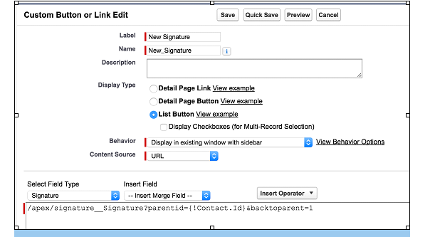

# Basic Configuration                                                                                       ##Chapter 2
>The steps necessary to set up the app for full use

# T
he initial steps in the configuration are completed by first installing the package from the AppExchange.com app store. Make sure to Install for All Users. Even though only an Admin will configure it, you need to install for All Users so
that they can access the pages correctly.

> Adding the Signature Form to Salesforce1

The first thing you will want to do is configure the Simple Signature form to show up on your Salesforce1 mobile apps.  
⦁	Make sure you are in the “ salesforce Lighning ” web version of Salesforce1, with Admin permissions.

⦁	At the top-right of the page click on Setup-->Apps-->Mobile Apps-->  Salesforce Navigation.  

⦁	Select “β Sign” from the pages on the left, and use the arrow key to move it to the items on the right.  Position it near the top so that it isn’t lost.

⦁	Press the Save button.

⦁	Now log into Salesforce and verify that you can, in fact, see the “Sign” tab.  

⦁	Test the process using the instructions in the next chapter.

⦁	Next, go back to the Lightning web version of Salesforce to continue configuring.

# Modifying the Signature Form

The next thing you need to do before beginning to use it is change what the form says in order to make it yours.
⦁	Make sure you are in the “Lightning” web version of Salesforce, with Admin permissions.

⦁	At the top-right of the page click on Setup-->  user interface  -->  Custom Labels.

⦁	Find and then click on the Name of the Page_Title custom label.

⦁	You will then be presented with a page where you can create a “Translation” for this particular item.  To do so, press the New button.

> * Note: If you do not see the “Translations” area shown in the screenshot above, go to Setup after that go to  Quick find box and type Translation Workbench  and then selectTranslation Settings and turn it on.  You should choose “English” or the native language of the users who will be using the form. 

⦁	Select a Language, typically “English” or the default language your users will be using, and then type in the Title you want at the top of the form.  Press the Save button, then click on the “Master Label” link, and you will see that this title is now a part of the form. 

⦁	If you have users with Salesforce set to a different language, you will need to repeat steps 4-5 for each of those languages.  If you do not, then they will default to seeing the title “Salesforce.com, Inc. Release Form”.

⦁	Now, go back to Step 3 and this time click on the Long Legal Text 1 item.  This is the text that will go under the title of the form, and before the fields and signature.  If you can fit it all in, then go ahead and do so, if not you can add text in the Long Legal Text 2 item.  Repeat Steps 4-6.

⦁	Now do the same Steps 3-6 for any other elements you wish to change on the form.
⦁	To remove fields, or add custom fields to the form, go to Setup  Create  Objects and then click on the Signature object.  
⦁	Scroll down to the “Field Set” section and click “Edit” on the SignatureFields field set.  You can now remove fields, reorder them, or add new fields to the form by dragging them down into the field set.
⦁	Once you are done, go back to Salesforce lightning  and test the “Sign” tab, making sure that your entire wording is now as you wish it to be.
> * Note: It is important to get this right before you start using the app, especially if you are using it for legal purposes.  When somebody signs and saves the record, the wording they agreed to is copied onto the record, so it is important that the wording be right before you start taking signatures.

## Adding Fields to the Signature Form
Using the steps above, you can add the fields that come with the form into the page.  However, you can add as many custom fields to the form as you desire.
⦁	Go to Setup  , click on object management and select Signature and the click the “New” button to add fields.  Repeat as necessary.

### Read-Only Fields (Optional)
If the Signature page is being called from a parent object (Opportunity, Contact, etc.), sometimes you might want read-only fields on the form. This gives the signer surety of what he or she is signing, and provides a better user experience.

⦁	Still in the Signature object, create any needed read-only field as formulas that pull data from the parent object (object from step #1.)  For example, if the parent object is the standard Opportunity object, and you want to pull in the Opportunity Name as read-only into the signature form, then create a formula field like this:

Field	API | Name | Field Type
------------ | ------------- | ---------------
Opportunity | Opportunity_Name__c	| 	Formula
Formula | Opportunity__r.Name | 

⦁	Once you’ve added all the fields you want, scroll down to the “Field Set” section and click “Edit” on the SignatureFields field set.  You can now remove fields, reorder them, or add new fields to the form by dragging them down into the field set.
⦁	Once you are done, go back to Salesforce lightning  and test the “Sign” tab, making sure that your entire wording is now as you wish it to be.

# Connecting to a Parent Object
 By default Signatures are stand-alone, but you can connect them to any object like Contracts, Orders, Cases or any other object.  Instructions to do so are below using the Contact object as an example:
 
⦁	Make sure you are in the “Lightning Salesforce ” web version of Salesforce, with Admin permissions.

⦁	At the top-right of the page click on Setup  after that click on object manager then click on Signature.

⦁	In the Fields and relationship section, press the New button and create a Lookup field to the object you want to have as the Signature parent.  (You can do more than one.)  Contact is already done for you.

⦁	Now scroll down to the Buttons, Links and Actions section, and click on the New Button or Link button.

⦁	Enter “New Signature” for the Label and then select List Button as the Display Type (and unselect the Display Checkboxes option). 

⦁	For the Behavior you can select what you think is best, and for the Content Source, choose URL.  Your screen should be something like this

⦁	Now, for the actual URL, you must customize it depending on the parent object that you selected.  If you are using Contacts, then the URL would be this:

    /apex/signature__Signature?parentid={!Contact.Id}&backtoparent=1

Parameter	Description
parentid	This will link the new Signature with a parent record of any type.  For example, for the Contact object, you would use the standard {!Contact.Id} formula field notation.
backtoparent	1 to take the user back to the parent record after the signature process completes, 0 (default) to leave the user on the newly created Signature record.

⦁	Save the Button.
Now, before continuing, a brief section on advanced parameters that can be used in the Paid version of the app.  If you do not have the Paid version, you can safely skip ahead.

# Advanced Parameters
The Paid Version of Simple Signature supports several other parameters that can be added to the URL in order to achieve advanced functionality.  For example, if you want to have an email automatically sent out requesting a signature from the contact attached to the Signature record, want to change what the form looks like, and want to attach the final PDF on the Contact, then you would construct a URL like this:

  >  /apex/signature__Signature?parentid={!Contact.Id}&backtoparent=1&pdftemplate=c__MyVFPage&emailpdf=1&attachpdftoparent=1&attachpdf=0 &requestedPDFName={!Contact.Name}_SignOff2017&defaultvalue_Phone__c={!Contact.MobilePhone}&defaultvalue_Email__c={!Contact.Email}&contactField=Customer_Contact__c&sdocstype=Contact&requestedform=My Form Name

#### Following is a list of parameters available in the paid version as shown in the sample URL in the above example:

Parameter	| Description
----------|-------------
pdftemplate |	The name of the VisualForce page to be used as the PDF template that is populated and then emailed to the contact attached to the Signature record once the submit button is pressed.  Note: The name must be pre-pended with "c__".
emailpdf |	1 to email the PDF generated to the contact attached, 0 (default) to do nothing.
attachpdf |	1 to attach the PDF generated to the Signature record, 0 (default) to do nothing.
attachpdftoparent |	1 to attach the PDF generated to the Parent record, 0 (default) to do nothing.
requestedform	 | The name of the form that is being requested; used for differentiating Signature requests.
requestedpdfname |	The name that you want the eventual PDF attachment to have. You can hard-code as well as include a fields from the value.  For example, for Contact parent object, where the Last Name was “Smith”, if you used the parameter this way: `“requestedPDFName={!Contact.Name}_SignOff2017”, then the resulting PDF woud be called: “Smith_SignOff2017.pdf”`  .
contactField	| If your parent object is not the Contact record, but you still want to attach a Contact to the Signature record (you must to this if you want any of the PDF/email automation), then you need to tell Simple Signature where the Contact field is supposed to come from.  For this, simply put the API name (not the label) of the Contact lookup field in the parent object.
sdocstype	| This is useful for s-Docs integration only.  Do not use this, if you do not have s-Docs installed.  The value of this parameter should be the API name of the parent object.  For example: Contact.  With this parameter, after the signature process, you will be re-directed to select an s-Docs template.
defaultvalue_XXX	| The “defaultvalue_” parameter is dynamic, the parameter name always starts the same, but then must use a name of a formula field in the Signature object.  For example: defaultvalue_InspectionDate__c or defaultvalue_CustomerContact__c.  More on using this to achieve read-only values on the Signature form in the next section.

 > `*` Note: the last few parameters are complicated, and may need some help from our support team.  Feel free to reach out to support@toafinish.com with questions.
 
#### After creating the signature button:

⦁	Now go to Setup  --> click on the object manager and click on Contacts and go to   Page Layouts after that click on  contact layout that will be exist in page layouts of contacts object.   (Note: if you selected a different object as the parent, then go to the page layouts for that object, not for Contacts.)

⦁	Click the Edit button next to the Page Layout that you want to add the Signature functionality to.  (Note: You might need to do this several times, depending on how many Page Layouts you are using. )(NOT REQUIRED )

⦁	Go to “Related Lists” and drag down the Signatures related list onto the layout. 

⦁	Edit the Signature related list to remove the standard “New” button and add the new button you just created.  Save the Layout and test it out.  
You are done!  Happy Signing!
 
 >> Or … Keep reading for more advanced functions.

 

# Using a Custom Signature Page

Most companies will be able to use the default signature page that comes with the app, but if you find yourself in need to changing more than just a couple fields, or having advanced functionality on this page, you can create your own version of the page that starts right where the standard one ends, and allows you to build onto it as needed.

> * Note: A fairly advanced user will be able to follow these instructions to replicate the standard functionality using a custom page, but adding new functionality will require a user with development experience.  Contact support@toafinish.com if you need help in this task.  We can answer questions, and if you need us to develop the page, we offer those services as well.  Let us know.

 1) First you will need to add a static resource to your org that allows the signature process.  Go to Setup > custom code > Static Resources and press the "New" button.  Call the Static Resource "SignPad", change the Cache Control to "Public" and then select a file called SignPad.zip that you will need to download from the "resources" folder in our GitHub repository.
GitHub.com Simple Signature Sample Code Repository |
---------------------------------------------------|
 https://github.com/ToAFinish/simplesignature | 

2) Next, you will need to create a new VisualForce page.  Go to Setup > Develop > VisualForce Pages and click the "New" button.  If the "New" button is not available, you will need to speak with your Administrator to get additional rights.  

3) Once you see a new bank VisualForce page, fill out the Label and Name fields and then delete all of the default content that is in the main VisualForce Markup area.  Now you are ready to put the actual code in.

4) Go back to the GitHub repository and this time go into the "pages" folder and click on the "CustomSignature" entry.  Copy all of the text in this page (without the line numbers), starting with <apex:page  and ending with </apex:page>.  Paste all of this text into the VisualForce Markup area in Salesforce and then Save the page.
Congratulations.  You've done the hardest part. Now - you need to make sure everybody can see your page.

5) First, go back to Setup > Develop > VisualForce Pages and find your new page on the list.  Click on the "Security" link next to the name of the new page.  A list of the profiles that can view this page will show up, you want to select all of them, or at least all of the ones who will use Simple Signature, and give them access. Save.

6) We recommend optionally giving your new page a Tab style.  To do so, go to Setup > Interface > Tabs and press "New" on the VisualForce Tabs section.  Choose the page that you created, name it, and then select a color and icon that you like.  Save.

> > Note: You might need to change the Salesforce lightning tab that you are using as described on page 10.

7) Now you need to go back and modify any custom URLs you have created using the instructions starting on page 13.  Change the "signature__Signature" page name to the name of your new page.  For example, if the URL looks like this:

   >  /apex/signature__Signature?parentid={!Contact.Id}&backtoparent=1

And your new page is called "CustomSignature", then the new URL would be:

  >  /apex/CustomSignature?parentid={!Contact.Id}&backtoparent=1

Test, test, test and if you run into issue, you can move the URL back until you figure them out.  Let us know if you need help: support@toafinish.com.

## Automatic Lead Creation

By default Signatures are created and then exist in Salesforce independently of other records.  However, in the Paid Version of Simple Signature, it is possible to have a Lead Created immediately each time somebody signs via the Signature page that was set up in the previous steps.  Here are the necessary steps.

1) First, the Lead creation functionality must be turned on.  Go to Setup > Apps > Packeging > Installed Packages and click on the "Configure" link next to the Simple Signature app.  If the paid version is enabled, you will see the "Configuration Steps: Options" panel.

 
2) Turn on the "Create Lead on Save" option, and then press the "Save Settings" button.

3) This might be all that is required as long as the only fields you need to be populated on the Lead are the First and Last name fields, and you have these fields on the Signature page.  However, many companies require other values to be populated for a Lead to be created.  If this is the case, you will need to add those values into the custom metadata area.  Go to Setup > custom Code > Custom MetaData Types and then click "Manage Records" next to the "Record_Creation" entry.

4) Add or modify the records in this area in order to either set default values for Lead fields or else copy the values from fields on the Signature page. 

5) Test by creating a signature, and then check to see that the Lead was created with all of the values you set up in step #4.

> * Note: this feature is fairly new, so please let us know if you run into issues: support@toafinish.com

 
