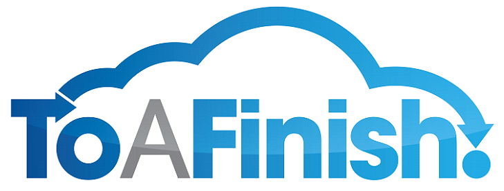

> # Introduction to this Implementation Guide
> Introducing all the key components of the Simple Signature App for Salesforce.com
## T
his manual will help you through the implementation of the Simple Signature app for your Salesforce.com Org.  You can read this chapter if you desire to do so, but most users can probably start at the next chapter, where the installation and configuration instructions begin.
> Thank you for considering our app in your organization. 

### icon key
⦁	Details You Can Skip

⦁	Don’t Miss This!

⦁	Sample Code

⦁	Danger!

To succeed in the installation process you will need to pay close attention to all of the information contained in this manual.  We recommend reading through this first chapter before you begin, and then reading through each section as you work on it.

The Icon Key to the left shows the icons you will be seeing as you go through this manual.  The more advanced readers can skip some of the details as indicated by the appropriate icon.

This manual is a work in progress, so please do take notes and let us know if you run into any issues with the text or if you believe there is a better way to accomplish the tasks we describe.
 

> # Introducing Salesforce.com

Salesforce.com's CRM solution is broken down into several broad categories: Sales Cloud, Service Cloud, Data Cloud (including Jigsaw), Collaboration Cloud (including Chatter) and Custom Cloud (including Force.com).  Below, we’ll highlight a few of them.

### The Sales Cloud

The Sales Cloud includes a real-time sales collaborative tool called Chatter, provides sales representatives with a customer profile and account history, allows the user to manage marketing campaign spending and performance across a variety of channels from a single application, tracks opportunity-related data including milestones, decision makers, customer communications, and other information unique to the company's sales process. Automatic email reminders can be scheduled to keep teams up to date.

Other activities on the Salesforce cloud include using the Jigsaw business data to access business contacts, and designing and automating processes in Salesforce CRM.

### The Service Cloud

The Service Cloud provides companies with a call center-like view that enables them to create and track cases coming in, and automatically route and escalate what’s important. The Salesforce CRM-powered customer portal provides customers the ability to track their own cases, includes a social networking plug-in that enables the user to join the conversation about their company on social networking websites, provides analytical tools and other services including email, chat, Google search, and access to customers' entitlement and contracts. 

### The Force.com Platform

Salesforce.com's platform as a service (PaaS) product is known as Force.com. The Force.com platform allows external developers to create add-on applications that integrate into the main salesforce.com application and are hosted on Salesforce.com's infrastructure.
These applications are built using Apex (a proprietary Java-like programming language for Force.com) and VisualForce (an XML-like syntax for building user interfaces in HTML or Flex).

### Web Services

In addition to the web interface, salesforce.com offers a SOAP/REST Web service API that enables integration with other systems. 
You can continue reading more on Salesforce.com at WikiPedia.com.

> # Introducing To A Finish

To A Finish™ is a concept company that has grown out of a desire to improve the Salesforce CRM consulting industry. Too often we have found the priorities of consulting companies skewed towards speed and profitability, rather than excellence and long-term success. This is not a blanket statement about all consulting companies, rather a general statement of the industry at large.

We believe there is a different way of consulting that will bring ultimate success to any CRM venture. The biggest difference is time. We give special attention to steps that are often rushed or even overlooked entirely in a typical project. Things like in-depth analysis, getting to really know a business, documentation and end-user involvement in the process help us set up a project for success. Ultimately, we must spend the time to do the work until it is absolutely complete; To A Finish™.

We are not guaranteeing our clients will never see a bug or have to rethink initial strategies. Reworking is actually part of the process of achieving success. What we are saying is that our strategies and focus will minimize unforeseen problems and achieve for us an ultimately successful project completion. We put our name on our work and stake our reputation on quality service.
Test us. Allow us to show you the difference of doing work To A Finish™.

You can find more about To A Finish at www.toafinish.com

  
When you finish a thing you ought to be able to say to yourself: "There, I am willing to stand for that piece of work. It is not pretty well done; it is done as well as I can do it; done to a complete finish. I will stand for that. I am willing to be judged by it."
## - O.S. Marden

> # Introducing Simple Signature 

Introducing a simple solution to capture signatures on the Force.com platform.  With Simple Signature you can acquire signatures on release forms, petitions, waivers, and other simple forms that need a few key data elements and a signature.  Simple.

Simple Signature is not intended to replace other document generation apps for Salesforce, but rather as a tool to quickly gather signatures, unencumbered by multiple-step processes or expensive, custom solutions.  No need to create a Lead or Contact record in advance; just read, enter your name and maybe a couple other things, and sign.  Keep it simple.  Get it done.

## Free vs. Paid App Comparison

The Paid version of Simple Signature includes many advantages.  See a chart comparing the versions below:

Feature	| Free	| Paid
------- | ---- | ----
Unlimited usage in Salesforce1, Classic and Lightning	| ✔	| ✔
Technical Support	|	| ✔
Field changes on the Signature Form	| Limited |	✔  
Custom/Multiple Signature Forms |		|✔
Link to Parent Object |	Limited	| ✔
Document Generation with s-Docs and COOLDOX | |		✔
Signature Request & Signature Completion Emails	| |	✔
Signature Request Tracking		| | ✔
Reports & Dashboards		| | ✔
Automated Lead Creation | |		✔

## Keep it Simple.  Get it done.

> # Before You Begin, Requirements

Before you begin working with our app, you must have several components already in place and configured.  We will not cover these components in detail, but will at least point you to where you can get the information you need.

### Salesforce.com

A production system Salesforce.com Org will be needed in order to set up the integration.  A sandbox will be very helpful in this process as well.  Any edition, Professional and above, of Salesforce.com should work. 

⦁	Sales Cloud
⦁	Service Cloud
⦁	Custom Cloud (Force.com)

> # Just out of BETA – What it Means

Simple Signature is a … simple app, so not much can go wrong, but still, we know that somebody is going to find something that is broken.  We just came out of BETA and most Salesforce users still haven’t tested our app.  So, please be gracious, and tell us about anything you run into.  Email at support@toafinish.com and we’ll gladly take a look at what you find.

> # Please, Please, Please … Review us!

We greatly enjoy being able to provide users with and app they will find useful.  And a few of those users sometimes need us to build other things for them, so having a free version is one of the ways we showcase our work for potential clients.

So, if you like the app, please leave us a positive review on the AppExchange:
https://appexchange.salesforce.com/listingDetail?listingId=a0N3A00000DqCoUUAV  .
But if you run into issues, please don't leave them there for the world to see (unless we can’t get it resolved).  Rather, contact us at support@toafinish.com and we'll work together to make this app To A FinishTM.

